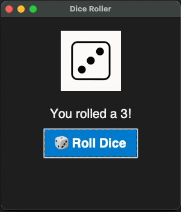

# Python-Dice-Roller
# 🎲 Dice Roller App (Python + Tkinter)

A fun, simple desktop dice roller application built using Python and Tkinter. Roll a virtual six-sided die with the click of a button! Great for board games, teaching beginner programming, or just some nerdy fun.

---

## 🖥️ Features

- Graphical interface with a dark theme
- Six unique dice face images
- Random dice roll each time you click
- Clean and minimal design

---

## 📸 Screenshot



---

## 🚀 Getting Started

### Requirements

- Python 3.8+
- Pillow (for image handling)
- Tkinter (usually comes with Python)

### Install dependencies

Create a virtual environment and install Pillow:

```bash
python3 -m venv venv
source venv/bin/activate
pip install pillow
