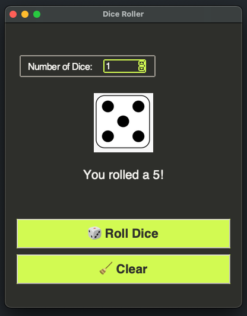

## 🎲 Dice Roller App

A Python desktop app using `tkinter` and `Pillow` to roll virtual dice with customizable quantity.

### 🆕 Features

- 🎲 Roll 1 to 10 dice
- 🔢 Shows individual results and total sum
- 📐 Dice image size adjusts with window resizing
- ✅ **New!** Added a **Clear Button** to reset the interface without closing the app

## 📸 Screenshot



---

## 🚀 Getting Started

### Requirements

- Python 3.8+
- Pillow (for image handling)
- Tkinter (usually comes with Python)

### Install dependencies

Create a virtual environment and install Pillow:

```bash
python3 -m venv venv
source venv/bin/activate
pip install pillow
```

### 🏃‍♂️ Run the app
```bash
python3 main.py
```